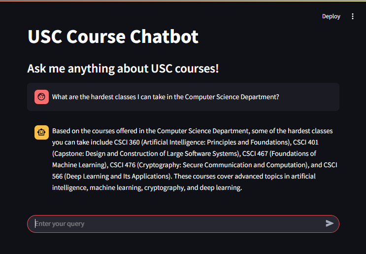

<!--
*** This README.md uses Best-README-Template.
*** It can be found at https://github.com/othneildrew/Best-README-Template
-->

<a id="readme-top"></a>

[![Workflow][workflow-shield]][workflow-url]
[![Contributors][contributors-shield]][contributors-url]
[![Forks][forks-shield]][forks-url]
[![Stargazers][stars-shield]][stars-url]
[![Issues][issues-shield]][issues-url]
[![project_license][license-shield]][license-url]

<!-- PROJECT LOGO -->
<br />
<div align="center">
  <a href="https://https://github.com/shogun-olives/usc-academic-advisor/">
    
  </a>

<h3 align="center">usc_academic_advisor</h3>

  <p align="center">
    A LLM based chatbot designed to help students at USC pick classes
    <br />
  </p>
</div>

<!-- TABLE OF CONTENTS -->
<details>
  <summary>Table of Contents</summary>
  <ol>
    <li>
      <a href="#about-the-project">About The Project</a>
      <ul>
        <li><a href="#built-with">Built With</a></li>
      </ul>
    </li>
    <li>
      <a href="#getting-started">Getting Started</a>
      <ul>
        <li><a href="#prerequisites">Prerequisites</a></li>
        <li><a href="#installation">Installation</a></li>
      </ul>
    </li>
    <li><a href="#roadmap">Roadmap</a></li>
    <li>
      <a href="#contributions">Contributors</a>
      <ul>
        <li><a href="#top contributors">Top Contributos</a></li>
        <li><a href="#acknowledgements">Acknowledgements</a></li>
      </ul>
  </ol>
</details>

<!-- ABOUT THE PROJECT -->

## About The Project

<div align="left">
  
</div>

Have you ever wanted to tailor your [USC Class](https://classes.usc.edu/) experience without having to annoy your advisors?

<p align="right">(<a href="#readme-top">back to top</a>)</p>

### Built With

[![Python][Python]][Python-url]
[![Pandas][Pandas]][Pandas-url]
[![ChatGPT][ChatGPT]][ChatGPT-url]
[![Streamlit][Streamlit]][Streamlit-url]
[![GirtHub][GitHub]][GitHub-url]

-   [ChatGPT](https://chatgpt.com/) 3.5 Turbo fine-tuned for academic advisement
-   [LangChain](https://www.langchain.com/) memory maintnance and tool usage
-   [Pandas](Pandas-url) for data management
-   [USC SOC API](https://web-app.usc.edu/web/soc/help) for real time retrieval augmented generation (RAG)
-   [Steamlit](https://docs.streamlit.io/) for easy-to-use UI

<p align="right">(<a href="#readme-top">back to top</a>)</p>

<!-- GETTING STARTED -->

## Getting Started

A brief step by step on how you can get this running on your local system

### Prerequisites

Before getting started, there are two requirements

-   Have [Python](https://www.python.org/) Installed on your device
-   Create an [OpenAI API Key](https://platform.openai.com/docs/overview) and add sufficient funds

### Installation

1. Clone the repo
    ```bash
    git clone https://github.com/shogun-olives/usc-academic-advisor
    ```
2. Create and activate a Python virtual environment
3. Install dependencies
    ```bash
    pip install -r requirements.txt
    ```
4. Create a `.env` file and enter your OpenAI API Key
    ```python
    OPENAI_API_KEY = "YOUR API KEY HERE"
    ```
5. Run the application
    ```bash
    streamlit run app.py
    ```

<p align="right">(<a href="#readme-top">back to top</a>)</p>

<!-- USAGE EXAMPLES -->

## Roadmap

-   [x] Basic Chat Features
    -   [x] Large language Model (LLM)
        -   [x] ChatGPT input/output (IO) framework
        -   [x] Custom model parameters
        -   [x] LangChain chat history memory
    -   [x] Retrieval Augmented Generation (RAG)
        -   [x] USC Schedule of Classes (SOC) API
        -   [x] Live data caching
        -   [x] Quick access functions
    -   [x] LLM and RAG Integration
-   [x] User Interface (UI)
    -   [x] Basic Streamlit UI
        -   [x] Allow users to chat with AI
        -   [x] Chat history is displayed
    -   [x] Side-Bar for displaying Schedule
        -   [x] Obtain schedule from LLM
        -   [x] Tabular display of data
-   [ ] Fine Tuning
    -   [ ] Create data for custom model features
    -   [ ] Train model and continue fine tuning

<p align="right">(<a href="#readme-top">back to top</a>)</p>

<!-- CONTRIBUTING -->

## Contributions

### Top contributors

<a href="https://github.com/shogun-olives/usc-academic-advisor/graphs/contributors">
  
</a>

### Acknowledgments

Prof. [Reza Jafarkhani](https://www.linkedin.com/in/reza-jafarkhani-a6065828/)
Prof. [Allen Bolourchi](https://www.linkedin.com/in/allenbolourchi/)

<p align="right">(<a href="#readme-top">back to top</a>)</p>

<!-- MARKDOWN LINKS & IMAGES -->

[workflow-shield]: https://img.shields.io/github/actions/workflow/status/shogun-olives/usc-academic-advisor/python-app.yml.svg?style=for-the-badge
[workflow-url]: https://github.com/shogun-olives/usc-academic-advisor/actions
[contributors-shield]: https://img.shields.io/github/contributors/shogun-olives/usc-academic-advisor.svg?style=for-the-badge
[contributors-url]: https://github.com/shogun-olives/usc-academic-advisor/graphs/contributors
[forks-shield]: https://img.shields.io/github/forks/shogun-olives/usc-academic-advisor.svg?style=for-the-badge
[forks-url]: https://github.com/shogun-olives/usc-academic-advisor/network/members
[stars-shield]: https://img.shields.io/github/stars/shogun-olives/usc-academic-advisor.svg?style=for-the-badge
[stars-url]: https://github.com/shogun-olives/usc-academic-advisor/stargazers
[issues-shield]: https://img.shields.io/github/issues/shogun-olives/usc-academic-advisor.svg?style=for-the-badge
[issues-url]: https://github.com/shogun-olives/usc-academic-advisor/issues
[license-shield]: https://img.shields.io/github/license/shogun-olives/usc-academic-advisor.svg?style=for-the-badge
[license-url]: https://github.com/shogun-olives/usc-academic-advisor/blob/master/LICENSE.txt
[linkedin-shield]: https://img.shields.io/badge/-LinkedIn-black.svg?style=for-the-badge&logo=linkedin&colorB=555
[linkedin-url]: https://linkedin.com/in/linkedin_username
[Python]: https://img.shields.io/badge/python-3670A0?style=for-the-badge&logo=python&logoColor=ffdd54
[Python-url]: https://www.python.org/
[ChatGPT]: https://img.shields.io/badge/chatGPT-74aa9c?style=for-the-badge&logo=openai&logoColor=white
[ChatGPT-url]: https://openai.com/
[Streamlit]: https://img.shields.io/badge/Streamlit-%23FE4B4B.svg?style=for-the-badge&logo=streamlit&logoColor=white
[Streamlit-url]: https://streamlit.io/
[Pandas]: https://img.shields.io/badge/pandas-%23150458.svg?style=for-the-badge&logo=pandas&logoColor=white
[Pandas-url]: https://pandas.pydata.org/
[GitHub]: https://img.shields.io/badge/github-%23121011.svg?style=for-the-badge&logo=github&logoColor=white
[GitHub-url]: https://github.com/
